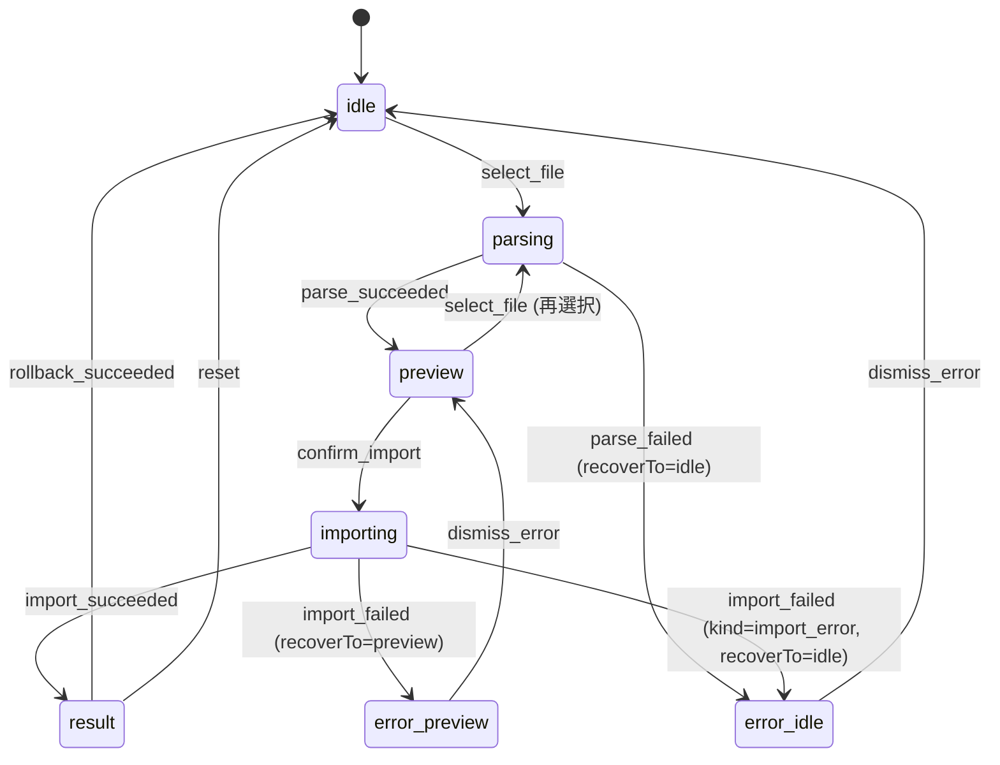

> **親文書**: [FUNCTION_DESIGN.md](../FUNCTION_DESIGN.md)
> **入力ドキュメント**: ARCHITECTURE.md（タスク仕様）、[ui-task-specs.md §UI-07](../architecture/ui-task-specs.md)（タスク要求）、[SCREEN_DESIGN.md §CSV取込み画面](../SCREEN_DESIGN.md)（レイアウト判断）、[32-biz-csv-import-service.md](32-biz-csv-import-service.md)（BIZ-03 型定義 + 業務ロジック SSOT）、[41-cmd-pos.md §17.5](41-cmd-pos.md)（CMD-07 シグネチャ + 入出力例）、[2026-05-13-phase-2-ui-07.md](../archive/plans/2026-05-13-phase-2-ui-07.md)（実装プラン、本書の判断根拠）

## 55. UI-07: 売上データ取込み画面

> **2026-06-30 redesign note**: UI-07 は「売上データ取込み」画面として再設計する。current operation の主動線は Z001/Z002/Z005 日報取込みであり、既存の Z004 CSV import UI 契約はPLU登録後の商品別売上・在庫引落しトラックとして残す。日報取込みは [37-biz-daily-report-import-service.md](37-biz-daily-report-import-service.md) / [45-cmd-daily-report-import.md](45-cmd-daily-report-import.md) を呼び、`sale_records` / `inventory_movements` を作らない。

### 55.0 REQ-401再設計ターゲット

#### 画面構成

| 取込みトラック | 既定 | CMD | 保存先 | 用途 |
|---|---|---|---|---|
| 日報取込み | 既定 | CMD-12 `parseAndValidateDailyReport` / `commitDailyReportImport` / `rollbackDailyReportImport` | `daily_report_imports`, `daily_report_*_lines` | 公式日報サマリ、支払集計、部門別売上 |
| 商品別CSV取込み（Z004） | PLU運用後の別トラック | CMD-07 `parseAndValidateCsv` / `commitCsvImport` / `rollbackCsvImport` | `csv_imports`, `csv_import_errors`, `sale_records`, `inventory_movements` | 商品別売上、在庫自動引落し候補 |

#### 日報取込みの利用者フロー

1. 画面タイトルは「売上データ取込み」。既定タブは「日報取込み」。
2. 利用者は native file dialog で PCツール / SDカードから取得した Z001/Z002/Z005 の3ファイルを同時に選ぶ。
   - 3ファイル以外の選択、読み取り失敗、サイズ超過は toast に加え、ファイル選択ボタン直下に destructive 系テキスト + アイコンで1スロット表示する。上部 Alert 帯は取込み済み / 上書き確認などデータ安全系の状態専用とし、選択操作の入力エラーとは混ぜない。
3. プレビューに対象日、3ファイル名、総売上/純売上、支払集計、部門別集計、部門未対応warningを表示する。
4. 同一bundle取込み済みはブロック。同一日別bundleは上書き確認を出す。
5. 第2スライスでは取込み結果に「日次売上を見る」CTAを表示し、`/reports/daily?date={reportDate}`（取込み対象日）へ遷移する。日次/月次売上画面では日報集計を公式表示し、商品別明細とは混ぜない。
6. 取消は日報取込みの論理rollbackであり、在庫数は変わらないことを結果画面に明示する。

#### 既存Z004 UIの扱い

- 既存 `CsvImportPage` / `useCsvImportFlow` / reducer はZ004商品別CSV取込みトラックとして維持できる。
- 画面文言「Z004形式の売上CSV」は既定主動線から外し、「商品別CSV取込み（Z004）」などPLU後の用途が分かる名称へ変更する。
- Z004トラックは、PLU登録後にZ004が商品別売上として取得できることを実機確認してから運用主導線に出す。

#### UI判断 ID

- `UI-07-D9`: 日報取込みとZ004商品別取込みを同一テーブル/同一結果として表示しない。理由は、Z001/Z002/Z005は集計日報であり商品別明細や在庫引落しを復元できないため。
- `UI-07-D10`: 日報取込みでは部門未対応をwarningとして表示し、取込み自体は可能にする。理由は、日報の正本性を優先し、部門マスタ修正を後続作業にできるようにするため。
- `UI-07-D11`: Z004取込みはPLU運用後の商品別・在庫連動トラックとして分ける。理由は、レジ変更時に日報主入力と商品別在庫連動のadapter差し替え点を分離するため。

### 本書のテンプレ判定（業務ロジックあり版、共通 6 項目）

UI 層関数設計書の 2 段階テンプレ（業務ロジック有無で使い分け、`memory/frontend-function-design-granularity.md`）に従い、UI-07 は**業務ロジックあり版**と判定する。

**判定根拠**:

- CMD 呼び出し: `commands.parseAndValidateCsv` / `commands.commitCsvImport` / `commands.rollbackCsvImport` / `commands.listCsvImports` の 4 件（3 useMutation + 1 useQuery）
- 入力バリデーション: ファイル拡張子 `.csv` / `.txt` + 上限 20MB の事前防御（BIZ-03 / CMD-07 でも検証されるが、UI 側でも誤選択を弾く）
- 画面内部 state 駆動のフロー分岐: あり（6 variant discriminated union `CsvImportState` × 9 action の reducer、`DuplicateStatus` による上書き確認分岐、`useBlocker` の importing 中常時 block）

→ **業務ロジックあり版**（複数 CMD + reducer 駆動分岐 + 排他制御）。共通 6 項目（モジュール構成 / React State / CMD 呼び出し / 利用者操作フロー / エラー表示 / ローディング表示）+ ショートカット・lifecycle / 状態遷移図 / エラーハンドリング備考 / テスト方針の 10 章構成。

| 種別 | 該当 UI |
|---|---|
| 業務ロジックあり版 | UI-00 / UI-shortcuts / UI-07（本書）/ UI-01a/b/c / UI-02〜10 / UI-13 |
| 業務ロジックなし版 | UI-12（[52-ui-shared-layout.md](52-ui-shared-layout.md)） |

UI-00 ([53-ui-home.md](53-ui-home.md)) が「4 useQuery 並列 + 部分障害許容」の初適用例、UI-shortcuts ([54-ui-shortcuts.md](54-ui-shortcuts.md)) が「CMD 呼び出し 0 件 + state 駆動分岐」の初適用例だったのに対し、本書は「3 useMutation + reducer 駆動フロー + commit/rollback の冪等性配慮 + `useBlocker` 排他制御」の初適用例。§55.2 で reducer の遷移表を確定し、§55.8 状態遷移図でその裏側を補完する。

---

### 55.1 モジュール構成

| ファイル | 責務 |
|---|---|
| `src/routes/csv-import.tsx` | TanStack Router file route。`<CsvImportPage />` mount のみに痩せる |
| `src/features/csv-import/CsvImportPage.tsx` | 最上位レイアウト。ページタイトル「売上データ取込み」とタブ（既定 `日報取込み` / `商品別CSV取込み（Z004）`）を所有する。Z004タブでは既存 `CsvImportFlowPanel` を表示する |
| `src/features/daily-report-import/DailyReportImportPage.tsx` | 日報取込みタブ。native dialog による Z001/Z002/Z005 3ファイル選択、プレビュー、上書き確認、取込み結果、論理取消を描画する |
| `src/features/daily-report-import/types.ts` | `DailyReportImportState`（6 variant discriminated union）+ `DailyReportImportAction` 等の日報画面ローカル型 |
| `src/features/daily-report-import/reducer.ts` | 日報取込み state 遷移の純関数。preview snapshot を importing/error 復帰に保持する |
| `src/features/daily-report-import/hooks/useDailyReportImportFlow.ts` | `useReducer + useMutation × 3 + useBlocker` を束ねる日報取込み hook。日報ファイル選択は `@tauri-apps/plugin-dialog.open` + `@tauri-apps/plugin-fs.readFile` で行い、CMD-12 を呼ぶ。ファイル選択ダイアログは前回選択フォルダ（localStorage key `inventory:daily-report-import:last-dir:v1`、選択パスから導出し件数チェック前に保存）を `defaultPath` に渡して開く。localStorage 不可の環境では記憶のみ無効化し選択フローは継続する（issue #135 派生。CASIO PCツール保存領域の深い年/月ディレクトリを毎回辿る operator 負担の除去）。commit/rollback 成功時に `dailyReportImportLists()`、`["daily-sales"]`、`monthlySalesRoot()` をinvalidateする |
| `src/features/daily-report-import/reducer.test.ts` | REQ-401 日報取込み UI state の focused unit tests |
| `src/features/csv-import/CsvImportPage.tsx` 内 `CsvImportFlowPanel` | 既存Z004取込みフローの本体。`useCsvImportFlow()` の戻り値を子コンポーネントに分配し、`state.status` で 4 step UI を切替（`ParseStep` / `PreviewStep` / `ImportingStep` / `ResultStep`）+ `error` variant 重ね描き |
| `src/features/csv-import/types.ts` | `CsvImportState`（6 variant discriminated union）+ `CsvImportAction`（9 variant）+ `ErrorRecoverTo` 等の画面ローカル型 |
| `src/features/csv-import/reducer.ts` | `csvImportReducer(state, action): CsvImportState` 純関数。9 action × 6 state の遷移表を 1 箇所に集約。テスト容易性のため副作用ゼロ |
| `src/features/csv-import/hooks/useCsvImportFlow.ts` | `useReducer + useMutation × 3 + useBlocker` を束ねる中核 hook。dispatch + 副作用 trigger 関数（`selectFile` / `confirmImport` / `rollback` / `reset`）を露出 |
| `src/features/csv-import/lib/extractFilename.ts` | `File` オブジェクトから filename 取り出し純関数。Windows パス区切り / 拡張子保持を担保（Phase 1 7-7 Vitest 着手後に unit test 追加可能） |
| `src/features/csv-import/lib/formatErrorRow.ts` | `ErrorRow.error_type` 4 値（`unmatched_product` / `invalid_format` / `invalid_jan` / `invalid_number`）→ Badge variant + ラベル変換純関数 |
| `src/features/csv-import/components/ParseStep.tsx` | step 1/3。`FileDropzone` + `Loader2` spinner（parsing 中）+ 状態文言 |
| `src/features/csv-import/components/PreviewStep.tsx` | step 2/3。`FileInfo` / `MatchedSummary` / `ErrorSummary` / `DuplicateCheck` の表示 + 「取り込む」「ファイルを選び直す」CTA |
| `src/features/csv-import/components/ImportingStep.tsx` | step 3/3（commit 進行中）。`Loader2 + animate-spin` + 「取込み中…数百行で約 N 秒かかります」補助文言 + 離脱不可バナー |
| `src/features/csv-import/components/ResultStep.tsx` | 完了表示。4 サマリ（csv_import_id / total_items / total_amount / skipped_count）+ 「売上レポートを見る」（UI-09a 着手済、`navigate({ to: "/reports/daily", search: { date: settlementDate } })` 遷移、Round 1 P1 fix で settlementDate URL state 化）+ 「取り消す」（rollback）+ 「ホームに戻る」 |
| `src/features/csv-import/components/ErrorState.tsx` | error variant の表示。CmdError kind 別メッセージ + 「最初に戻る」or「プレビューに戻る」ボタン（`recoverTo` で分岐）|
| `src/features/csv-import/components/OverwriteConfirmDialog.tsx` | `DuplicateStatus === "OverwriteRequired"` 時の確認ダイアログ。shadcn `<AlertDialog>` 使用、Esc で cancel（Radix 標準）|
| `src/features/csv-import/components/ErrorRowsTable.tsx` | `ErrorSummary.items`（最大 100 件）の表示。`formatErrorRow` の Badge variant で色分け + `normalized_jan === null` で「(不明)」表示 |
| `src/features/csv-import/components/FileDropzone.tsx` | plain `<input type="file" accept=".csv,.txt">` + `onDrop` / `onDragOver` ハンドラ。UI_TECH_STACK §6.5.4 暫定例外、plugin-dialog 移行は Phase 3 で別 PR |
| `src/features/csv-import/components/StepIndicator.tsx` | "1/3 ファイル選択" / "2/3 プレビュー" / "3/3 結果" のステップ表示 |

**接続点**:

- `src/routes/csv-import.tsx` が `<CsvImportPage />` を mount。TanStack Router の file-based routing で `/csv-import` パスに自動マップ
- `src/config/navigation.ts` の `ui-07` entry は `to: "/csv-import"` + `status: "active"` のまま、label/title を「売上データ取込み」にする
- `src/lib/query-keys.ts` に prefix helper `csvImportLists` と `dailyReportImportLists` を置く（§55.3 参照）
- `src/lib/bindings.ts` は commit 2 で `parse_and_validate_csv` / `commit_csv_import` / `rollback_csv_import` を specta 経由で自動再生成（`list_csv_imports` は UI-00 commit `2c1ac37` で済）
- CMD-12 実装PRでは `parse_and_validate_daily_report` / `commit_daily_report_import` / `rollback_daily_report_import` / `list_daily_report_imports` も specta 経由で自動再生成する

---

### 55.2 React State

UI-07 は `useReducer + discriminated union` の自力 state 機械（D-1: `feedback-recommend-with-explicit-basis.md` 適用 + Zustand 未導入 verify 済、状態数 6 の直線フロー、並行 / cancel / resume なし）+ 3 useMutation で構成。グローバル state は使わない（UI_TECH_STACK §2.6 維持）。

#### `CsvImportState` 6 variant 定義

```ts
export type CsvImportState =
  | { status: "idle" }
  | { status: "parsing"; filename: string }
  | { status: "preview"; preview: PreviewData; previewToken: string; filename: string }
  | { status: "importing"; preview: PreviewData; previewToken: string; overwriteConfirmed: boolean; filename: string }
  | { status: "result"; result: ImportResult; settlementDate: string }
  | { status: "error"; error: InvokeError; recoverTo: "idle" | "preview"; previousState: CsvImportState };
```

- `previousState` 保持の根拠: error から preview に戻る経路で `preview` / `previewToken` / `filename` を捨てたくない。`recoverTo === "preview"` の時は reducer が `import_failed` 処理内で **preview variant を再構築して** `previousState` に詰める（importing variant をそのまま保存すると `dismiss_error` 側の型 narrow (`previousState.status === "preview"`) で受理できず idle にフォールバックしてしまう、PR #62 Codex Round 1 P2-1 起因の修正）
- `preview` (PreviewData) を `preview` / `importing` の 2 箇所に持つ根拠: `confirm_import` で `preview → importing` 遷移時に PreviewData を捨ててしまうと、`import_failed(recoverTo: "preview")` 時に preview variant を再構築できない。`importing` 中も snapshot として保持し、復帰経路の型安全を担保する
- `previewToken` を `preview` / `importing` の 2 箇所に持つ根拠: BIZ-03 の preview キャッシュは preview_token をキーに 30 分有効。`importing` 中も保持して rollback / 失敗時の再 commit を支える

#### `CsvImportAction` 9 variant 定義

```ts
export type CsvImportAction =
  | { type: "select_file"; filename: string }
  | { type: "parse_succeeded"; preview: PreviewData; previewToken: string }
  | { type: "parse_failed"; error: InvokeError }
  | { type: "confirm_import"; overwriteConfirmed: boolean }
  | { type: "import_succeeded"; result: ImportResult; settlementDate: string }
  | { type: "import_failed"; error: InvokeError; recoverTo: "idle" | "preview" }
  | { type: "dismiss_error" }
  | { type: "rollback_succeeded" }
  | { type: "reset" };
```

`rollback_failed` は別 action にせず、rollback の useMutation `onError` で Sonner トースト + `state` 据え置きとする（rollback 失敗時に state を壊さない設計、`commands.listCsvImports` を再 fetch して result 表示は維持）。

#### reducer 遷移表（純関数 `csvImportReducer`）

| 現 state | action | 遷移先 | 備考 |
|---|---|---|---|
| `idle` | `select_file` | `parsing` | `parseAndValidateMutation.mutate(...)` 副作用は hook 側 |
| `parsing` | `parse_succeeded` | `preview` | preview + previewToken + filename を持ち越す |
| `parsing` | `parse_failed` | `error (recoverTo: "idle")` | filename 等は破棄、idle に戻す |
| `preview` | `confirm_import` | `importing` | overwriteConfirmed = `DuplicateStatus === "OverwriteRequired"` 時のみ true。preview / previewToken / filename を `importing` state に snapshot として持ち越す（`import_failed(recoverTo: "preview")` 時の復帰経路で preview variant 再構築に必要） |
| `preview` | `select_file` | `parsing` | 「ファイルを選び直す」CTA からの再 parse |
| `importing` | `import_succeeded` | `result` | settlementDate は preview.fileInfo から hook 側で抽出して action に詰める |
| `importing` | `import_failed` | `error (recoverTo: action.recoverTo)` | キャッシュ期限切れ等で「最初に戻る」分岐は kind 判定で hook 側が決定。reducer は `recoverTo === "preview"` の時 importing の preview snapshot から preview variant を再構築して `previousState` に詰める。それ以外は `state` (importing variant) を `previousState` にそのまま入れる |
| `result` | `rollback_succeeded` | `idle` | result 表示を破棄して初期化 |
| `result` | `reset` | `idle` | 「ホームに戻る」CTA からの明示 reset |
| `error` | `dismiss_error` | `previousState` (recoverTo: "preview") or `idle` | previousState を復元 / idle に戻す |
| 任意 state | `reset` | `idle` | 例外フロー（navigation 抜け道）用、commit 5 で 1 箇所のみ呼ぶ |

invalid 遷移（例: `idle` で `parse_succeeded`）は reducer 内で現 state をそのまま返す（state-machine 厳格化は Phase 1 7-7 Vitest 着手後に network test で違反検知できるようになるまで猶予）。

#### 3 useMutation のデータ

| useMutation | 入力 | 出力 |
|---|---|---|
| `parseAndValidateMutation` | `{ fileBytes: number[]; filename: string }` | `{ previewData: PreviewData; previewToken: string }` |
| `commitMutation` | `{ previewToken: string; overwriteConfirmed: boolean }` | `ImportResult` |
| `rollbackMutation` | `{ csvImportId: number }` | `RollbackResult` |

`commands.*` 経由は specta 自動 camelCase 化（CMD 引数: `file_bytes` → `fileBytes`、`overwrite_confirmed` → `overwriteConfirmed`、`csv_import_id` → `csvImportId`）。struct field は snake_case 直接アクセス（`previewData.file_info.settlement_date` 等、[53-ui-home.md §53.2 bindings.ts subsection](53-ui-home.md) と同方針）。

#### File → Vec<u8> 変換

`<input type="file">` から得た `File` オブジェクトを `await file.arrayBuffer()` → `Array.from(new Uint8Array(buffer))` で `number[]` 化（specta 経由で Rust `Vec<u8>` に直マップ）。20MB 上限は CMD-07 で再検証されるが、UI 側でも `file.size > 20 * 1024 * 1024` で早期 reject + Sonner トースト（CMD-07 経由のラウンドトリップを避ける）。

#### 派生値

| 派生値 | 計算 | 計算箇所 |
|---|---|---|
| `currentStep` | `state.status === "idle" \|\| "parsing"` → 1、`"preview"` → 2、`"importing" \|\| "result"` → 3 | `CsvImportPage.tsx` render 時直接、`useMemo` 不要 |
| `requiresOverwriteConfirm` | `state.status === "preview" && state.preview.duplicate_check.status === "OverwriteRequired"` | `PreviewStep.tsx` 内、render 時直接 |
| `errorRowsCount` | `state.status === "preview" ? state.preview.error_summary.count : 0` | 同上 |
| `showLeaveBlocker` | `state.status === "importing"` | `useCsvImportFlow` から戻り値で露出、`useBlocker` の判定式 |

---

### 55.3 CMD 呼び出しパターン

D-4 採用 → 既存 `src/lib/query-keys.ts`（[53-ui-home.md §53.3](53-ui-home.md) で commit 3 新設）に prefix helper を追加し、commit 成功時の invalidation を helper 経由で呼ぶ。直書きはタイポで cache miss が起きるため禁止。

#### 3 useMutation の queryKey 不要 / onSuccess invalidation

useMutation には queryKey を持たせない（TanStack Query v5 仕様、mutation は cache 対象外）。代わりに `onSuccess` で `queryClient.invalidateQueries(...)` を呼ぶ。

| useMutation | mutationFn | onSuccess invalidation 対象 |
|---|---|---|
| `parseAndValidateMutation` | `(args) => unwrapResult(commands.parseAndValidateCsv(args.fileBytes, args.filename))` | なし（preview はキャッシュ非対象、CMD 層内部 memory cache に保持） |
| `commitMutation` | `(args) => unwrapResult(commands.commitCsvImport(args.previewToken, args.overwriteConfirmed))` | `queryKeys.csvImportLists()`（prefix match で `["csv-imports", "list", ...]` 配下全 invalidate）+ `["daily-sales"]` prefix（UI-09a 着手で `dailySales(settlementDate)` 単一 → prefix 化、UI-00 ホームの `dailySales(yesterday)` + UI-09a の `dailySales(today)` 両方 refetch、取込み直後 UX 上望ましい波及）+ `queryKeys.lowStock(false)` + `queryKeys.pluDirty()` |
| `rollbackMutation` | `(args) => unwrapResult(commands.rollbackCsvImport(args.csvImportId))` | commit と同じ 4 件（rollback は逆方向だが帳簿への影響範囲は同じ） |

**prefix helper 追加の根拠**: UI-00 ホーム画面は `queryKeys.csvImports(1, 1)`（最終取込み 1 件取得）を購読するが、UI-07 一覧側は `queryKeys.csvImports(1, 5)` 等の別 page/perPage を想定する。page/perPage 違いで cache key が分かれるため、`csvImportLists: () => ["csv-imports", "list"] as const` という prefix helper を `query-keys.ts` に追加し（commit 3 同梱）、commit / rollback 成功時は `invalidateQueries({ queryKey: queryKeys.csvImportLists() })` で `["csv-imports", "list", ...]` 配下を一括 invalidate する。これは UI-00 の `lowStock` / `pluDirty` パターンと同じ TanStack Query v5 標準の prefix match 仕様（[v5 docs](https://tanstack.com/query/v5/docs/framework/react/guides/query-invalidation)）。

#### 1 useQuery（一覧側は本 PR ではホーム画面が既購読のため新設しない）

UI-07 画面内には CSV 取込み履歴の表示はない（PreviewStep が duplicate_check.existing_import_id を表示するのみ）。Phase 3 以降で取込み履歴一覧画面を別途新設する想定（[ui-task-specs.md §UI-07](../architecture/ui-task-specs.md) には現状履歴一覧の指定なし）。本 PR では `useQuery({ queryKey: queryKeys.csvImportLists() })` は呼ばない。

#### settlementDate 抽出の責務

`commitMutation.onSuccess` で `queryKeys.dailySales(settlementDate)` を invalidate する際の `settlementDate` は、`state.status === "preview"` の `preview.file_info.settlement_date` から `useCsvImportFlow` 内で取り出して action に詰める。`import_succeeded` action に `settlementDate` を含めるのはこのため（§55.2 reducer 遷移表）。

#### CMD エラー経路

`unwrapResult` は PR #48 の `src/lib/invoke.ts` で導入済 helper。Result 型 `{ status: "ok"; data } | { status: "error"; error }` を解いて、エラー時は `InvokeError` を throw、成功時は data を返す。useMutation の `onError` で受け取り、`dispatch({ type: "parse_failed" \| "import_failed", error })` する。

#### specta 化対象（commit 2 で実施）

| 関数 | 状態 |
|---|---|
| `parse_and_validate_csv` | **specta 化対象**（commit 2 で `#[specta::specta]` + struct/enum `specta::Type` derive 追加） |
| `commit_csv_import` | 同上 |
| `rollback_csv_import` | 同上 |
| `list_csv_imports` | 既に specta 化済（UI-00 commit `2c1ac37`） |

Phase 2 closeout で `typedInvoke` fallback / baseline 監視は撤去済み。CSV 取込みは `commands.*` + `unwrapResult` の生成 bindings 経路のみを使う。

---

### 55.4 利用者操作フロー

[ui-task-specs.md §UI-07](../architecture/ui-task-specs.md) の業務的概要は本書で重複させず、実装詳細寄りに限定する（`memory/frontend-function-design-granularity.md` 規定）。

**画面遷移時**:

1. `<CsvImportPage />` mount → `useCsvImportFlow()` で reducer 初期化（`{ status: "idle" }`）+ 3 useMutation + `useBlocker` 登録
2. `StepIndicator` "1/3 ファイル選択" + `FileDropzone` 表示

**ファイル選択 / drag&drop**:

3. `<input type="file" accept=".csv,.txt">` または `onDrop` ハンドラで `File` 取得 → サイズ判定（>20MB なら Sonner トースト + 早期 reject）→ `await file.arrayBuffer()` → `number[]` 化 → `dispatch({ type: "select_file", filename })` + `parseAndValidateMutation.mutate({ fileBytes, filename })`
4. parsing 中: `ParseStep` が `Loader2 + animate-spin` + 「ファイルを解析中…」状態文言 + 5 秒目安の補助文言
5. 成功時: `dispatch({ type: "parse_succeeded", preview, previewToken })` → `preview` state へ遷移

**プレビュー確認**:

6. `StepIndicator` "2/3 プレビュー" + `PreviewStep` mount
7. `FileInfo` セクション（精算日 + 元ファイル名 + file_hash 先頭 8 文字）+ `MatchedSummary`（紐付け成功 N 件 / 合計 M 円 / 警告 K 件）+ `ErrorSummary`（エラー N 件、`ErrorRowsTable` 展開可能）+ `DuplicateCheck` 表示
8. `duplicate_check.status === "NoDuplicate"` → 「取り込む」CTA 即押下可能
9. `duplicate_check.status === "OverwriteRequired"` → 「取り込む」CTA 押下時に `OverwriteConfirmDialog` 表示、OK で `confirm_import (overwriteConfirmed=true)`、Cancel で preview 維持
10. 「ファイルを選び直す」CTA → `dispatch({ type: "select_file" })` で再 parse（旧 preview を破棄）

**取込み実行**:

11. `dispatch({ type: "confirm_import", overwriteConfirmed })` → `commitMutation.mutate({ previewToken, overwriteConfirmed })`
12. importing 中: `ImportingStep` が `Loader2 + animate-spin` + 「取込み中…数百行で約 N 秒かかります」+ 離脱不可バナー
13. `useBlocker` が `state.status === "importing"` 期間 navigation を block（§55.7）
14. 成功時: `dispatch({ type: "import_succeeded", result, settlementDate })` → `result` state へ遷移 + 4 件 invalidation

**結果確認**:

15. `StepIndicator` "3/3 結果" + `ResultStep` mount
16. 4 サマリ表示（csv_import_id / total_items / total_amount / skipped_count）+ status badge（`"completed"` = 成功 / `"completed_partial"` = 部分成功）
17. 「売上レポートを見る」CTA → `navigate({ to: "/reports/daily", search: { date: settlementDate } })` で UI-09a 日次売上レポート画面へ遷移、settlementDate を URL state で渡して取込み済 (≠当日) のケースでも対象日のデータを直接表示（UI-09a PR Round 1 P1 fix で確立、`aria-disabled` + Tooltip + `onClick preventDefault` の disabled 状態は撤去済）
18. 「取り消す」CTA → `<AlertDialog>` で確認 → `rollbackMutation.mutate({ csvImportId: result.csv_import_id })` → 成功時 `rollback_succeeded` で idle に戻る
19. 「ホームに戻る」CTA → `router.navigate({ to: "/" })`、Sidebar 経由でもよい

**Error 経路**:

20. parse_failed / import_failed → `error` variant、`ErrorState` 重ね描き、`recoverTo` に従い「最初に戻る」or「プレビューに戻る」CTA（§55.5）

---

### 55.5 エラー表示

#### CmdError kind 別表示マトリクス

`unwrapResult` が throw する `InvokeError` は `kind` プロパティを持つ。useMutation `onError` で受け取り、以下の方針で表示する。

| CmdError.kind | 表示 | recoverTo | 補足 |
|---|---|---|---|
| `import_error` | `ErrorState` フルスクリーン表示。「再度ファイルを選択してください」+ メッセージ本文（BIZ-03 由来の日本語）+「最初に戻る」ボタン | `"idle"` | キャッシュ期限切れ（30 分超）/ プレビュー消失 / 重複ブロック。preview に戻っても再利用不可、idle 強制 |
| `validation` | `ErrorState` 表示。recoverTo は元 state による（parsing → idle、importing → preview） | `"idle"` or `"preview"` | サイズ超過 / プレビュー token 不正等、CMD-07 入口で弾かれた防御チェック |
| `internal` | Sonner トースト「データベースエラーが発生しました」+ state は据え置き | 該当なし（state 据え置き） | DB ロック競合等、リトライ可能 |
| `not_found` | Sonner トースト + state 据え置き | 該当なし | rollback 時の csv_import_id 不在等（理論上 result variant からは発生しないが念のため） |

`recoverTo` の決定は hook 側で kind から導出する: `import_error` → `"idle"` 固定、それ以外は `state.status` で分岐（parsing 由来なら `"idle"`、importing 由来なら `"preview"`）。

#### `ErrorState.tsx` の描画ロジック

shadcn `<Alert variant="destructive">` でアイコン + タイトル + 本文 + ボタン。タイトルは kind 別固定文言（「プレビューが利用できません」/「入力に問題があります」/「エラーが発生しました」）、本文は `error.message` をそのまま表示。

#### `ErrorRowsTable.tsx` の描画ロジック

`PreviewStep` 内で展開可能な `<Accordion>`（shadcn）で表示、初期は折りたたみ。`ErrorSummary.items` は最大 100 件（BIZ-03 制限）、超過時は「他 N 件は CSV ログ参照」と末尾に表示。各行は `<TableRow>` で表示し、`error_type` 4 値ごとに `<Badge>` variant で色分けする。

| error_type | Badge variant | ラベル | 表示時の特記 |
|---|---|---|---|
| `unmatched_product` | `secondary`（青系）| 「未登録 JAN」 | 商品マスタへの新規追加で次回取込み時に紐付け |
| `invalid_format` | `destructive`（赤系）| 「フォーマット異常」 | normalized_jan が null になる可能性あり → 「(不明)」表示 |
| `invalid_jan` | `outline`（橙系）| 「JAN 不正」 | normalized_jan は元の値を表示 |
| `invalid_number` | `outline`（橙系）| 「数値不正」 | raw_quantity / raw_amount を `<code>` で表示 |

`normalized_jan === null` のセルは「(不明)」と表示する（`formatErrorRow` で吸収）。

#### retry 戦略

useMutation の retry は TanStack Query v5 default で 3 回。本 PR では `retry: 0` に明示設定（CSV 取込みは状態 mutation のため自動 retry すると preview cache の整合性が崩れる可能性、明示再実行に限定）。

#### Exit 条件（本パターン再検討トリガー）

- 1 取込み当たりの error_rows が >500 件に膨れたら（現状 100 件上限なので Phase 2 内ではあり得ない）、`PreviewStep` の `<Accordion>` から専用画面 `/csv-import/errors/:previewToken` への分離を検討
- `import_error` の発生率が利用者デモで 10% 超なら、preview キャッシュ TTL を 30 分から 60 分に伸ばす BIZ-03 側の調整を検討

---

### 55.6 ローディング表示

#### Spinner 戦略（step 単位）

各 useMutation の `isPending === true` 中、対応 step の UI を spinner + 状態文言で覆う。

| Step | Spinner | 状態文言 | 補助文言 |
|---|---|---|---|
| `ParseStep`（parsing 中） | `<Loader2 className="size-8 animate-spin">` | 「ファイルを解析中…」 | 「数百行で約 1-3 秒かかります」 |
| `ImportingStep`（importing 中） | 同上 | 「取込み中…」 | 「数百行で約 1-3 秒、数千行で約 5-10 秒かかります」+ 「他の画面に移れません」離脱不可バナー |
| `ResultStep`（rollback 進行中） | inline `<Loader2 className="size-4 animate-spin">` を「取り消す」ボタン内に表示 | ボタンラベル「取り消し中…」 | なし（result 画面は維持） |

**根拠（陳腐演出を採らない理由）**:

- 「点三つ 1 秒ずつ」演出は state-fake で実装すると IPC 完了タイミングと乖離する。`Loader2 + animate-spin` は CSS アニメで完結し、状態文言が IPC 完了を SSOT として可視化する
- Importing 時のみ補助文言「数百行で約 N 秒…」を入れる理由: parsing は 1-3 秒に収束する想定だが、commit は SQLite TX 内で在庫変動 + price_history + sale_records の 3 テーブルに insert + update が走るため、行数依存で 5-10 秒に伸びる。利用者の「固まったか」不安を予防する

#### lucide-react `<Loader2>` 採用

`Loader2` は shadcn/ui で標準的に推奨されるスピナー（lucide-react）。CSS `animate-spin` で 360° 回転、Tailwind `size-8` / `size-4` で大小切替。`<Spinner>` 自作は不要（shadcn 推奨に従う）。

#### Skeleton は使わない

UI-00 ([53-ui-home.md §53.6](53-ui-home.md)) のような Skeleton は本画面では不要。Skeleton は「何を表示するか型は確定しているがデータ未到着」のときに使う UI で、CSV 取込みは「ユーザー操作起点でデータが流れる」フローのため spinner + 状態文言が適切。

#### 初回画面表示時

idle state では特に loading 表示なし。`FileDropzone` が常時 mount され、ファイル選択 / drag&drop を待つ。

---

### 55.7 ショートカット / lifecycle

#### UI-07 固有のショートカット

**なし**。`OverwriteConfirmDialog` の Esc キーは Radix `<AlertDialog>` 標準（cancel として動作）。グローバル Ctrl+/ は [54-ui-shortcuts.md](54-ui-shortcuts.md) で実装済、本画面でも `RootLayout` 層からの dispatch でダイアログが開く。

各画面 PR で固有のキー組合せが必要になった場合は `src/features/shortcuts/data.ts` の `SHORTCUTS` 配列に `category: "screen"` で追記（[54-ui-shortcuts.md §54.1 拡張点](54-ui-shortcuts.md)）。UI-07 はファイル選択 + ボタンクリックで完結するため shortcut 追加なし。

#### `useBlocker` による importing 中の常時 block

TanStack Router の `useBlocker` を `useCsvImportFlow` 内で登録し、`state.status === "importing"` 期間中の navigation を block する。

```ts
useBlocker({
  shouldBlockFn: () => state.status === "importing",
  enableBeforeUnload: () => state.status === "importing",
});
```

**設計判断 — 確認ダイアログ無しの常時 block**:

- importing 中に確認ダイアログを出すと、利用者が「はい」を押した場合に commit IPC が完了する前に画面が unmount され、`commitMutation.onSuccess` の invalidation / settlementDate state 反映 / Sonner success トーストが page unmount 後に走る → state が宙に浮く
- 解: 常時 block + 画面上に状態バナー「取込み完了まで他画面に移れません」を ImportingStep 内で表示。利用者は画面外操作（Sidebar クリック / ブラウザバック）が無視されるが、画面内の操作は IPC 完了を待つだけなので体感的な詰まり感はない（数秒〜10 秒程度）
- `enableBeforeUnload`: アプリ全体 close / リロード時にもブラウザ標準の「変更を保存していない可能性…」確認を出す。Tauri webview は beforeunload を尊重する

#### `useBlocker` の解除タイミング

- `importing` → `result` 遷移時、自動解除
- `importing` → `error` 遷移時、自動解除（error 後の navigation は許可）
- `result` / `error` / `idle` / `parsing` / `preview` の各 state では block しない

#### page unmount 後の state 喪失問題

`useCsvImportFlow` の reducer state は `<CsvImportPage />` unmount で破棄される。`result` state 中に Sidebar 経由で他画面に遷移するとサマリは消える（再訪時は idle に戻る）。これは仕様（一過性の作業画面）として受容。長期 visibility が必要な場合は `commands.listCsvImports` 経由で履歴一覧画面（Phase 3 以降）に振る。

---

### 55.8 状態遷移図



ASCII 版（mermaid 非対応環境用）:

```
[idle] --select_file--> [parsing]
[parsing] --parse_succeeded--> [preview]
[parsing] --parse_failed--> [error(recoverTo=idle)]
[preview] --confirm_import--> [importing]
[preview] --select_file--> [parsing]
[importing] --import_succeeded--> [result]
[importing] --import_failed(generic)--> [error(recoverTo=preview)]
[importing] --import_failed(import_error)--> [error(recoverTo=idle)]
[result] --rollback_succeeded--> [idle]
[result] --reset--> [idle]
[error(recoverTo=idle)] --dismiss_error--> [idle]
[error(recoverTo=preview)] --dismiss_error--> [preview]
```

network test（Phase 1 7-7 Vitest 着手後）で 9 action × 6 state = 54 組合せのうち、上記 13 個の valid 遷移 + 41 個の invalid 遷移（state 据え置き）を網羅する設計。

---

### 55.9 エラーハンドリング備考

#### `CMD_ERROR_KIND` 型安全分岐

`src/lib/invoke.ts` の `CMD_ERROR_KIND` const は `IMPORT_ERROR: "import_error"` を含む（PR #48 commit `c5f3786` で導入済）。`useCsvImportFlow` 内で kind 別の `recoverTo` 決定を以下の形で書く:

```ts
function decideRecoverTo(error: InvokeError, currentStatus: CsvImportState["status"]): "idle" | "preview" {
  if (error.kind === CMD_ERROR_KIND.IMPORT_ERROR) return "idle";
  if (currentStatus === "parsing") return "idle";
  return "preview";
}
```

直書き `if (error.kind === "import_error")` を禁止する根拠: タイポによる分岐漏れを防ぐ。`CmdErrorKind` 型（`(typeof CMD_ERROR_KIND)[keyof typeof CMD_ERROR_KIND]`）で TypeScript が静的検査する。

#### preview キャッシュ期限切れの UX

BIZ-03 §15.9 で preview キャッシュは 30 分有効。30 分超過後の commit は `BizError::ImportError("プレビューの有効期限が切れました（30 分）。再度ファイルを選択してください")` → CMD-07 で `CmdError { kind: "import_error", message: "..." }` に変換 → UI で `recoverTo: "idle"` → 「最初に戻る」CTA で idle に戻る。

#### rollback 失敗の UX

`rollbackMutation.onError` で Sonner トースト「取り消しに失敗しました。もう一度お試しください」+ state は `result` 据え置き。利用者は再度「取り消す」を押下できる。data-corruption は BIZ-03 §15.5 の TX で保護されているため、UI 側で特殊な復旧は不要。

#### `internal` kind の沈黙ポリシー

DB ロック競合等の `internal` は Sonner トーストのみで state を据え置く。これは UI-00 の pluDirty / csvImports クエリ失敗時の「誤検知より沈黙を選ぶ」方針（[53-ui-home.md §53.5](53-ui-home.md)）と整合的。CSV 取込みは利用者がリトライ判断できる文脈なので、強制的に state を巻き戻さない。

---

### 55.10 テスト方針

#### Phase 1 7-7 Vitest 未着手のため、本 PR では unit test なし

`src/features/csv-import/reducer.ts` は副作用ゼロの純関数。9 action × 6 state = 54 組合せのテスト（13 個の valid 遷移 + 41 個の invalid 遷移網羅）は 7-7 着手後の最優先 retroactive 追加対象（[53-ui-home.md §53.9 非目的](53-ui-home.md) と同方針）。

#### Windows native cargo tauri dev での手動 10 項目シナリオ

memory `tauri2-linux-ime-limitation.md` 準拠、Phase 2 以降 Windows native ビルド前提。詳細は実装プラン [2026-05-13-phase-2-ui-07.md §7.3](../archive/plans/2026-05-13-phase-2-ui-07.md) を参照。

要約: 基本動線 2 項目 (ファイル選択 / SJIS-UTF-8 自動判定) + 合成 fixture 主 6 項目 (PreviewStep / 件数 / OK commit / 進捗 / SuccessStep / ホーム invalidation) + 実 PLU 副 1 項目 (ErrorStep) + UI 単独 1 項目 (useBlocker) の 10 項目を実機で確認する。

#### 検証データ戦略 (2026-05-15 確定)

本 PR では実機 Casio SR-S4000 の Z004 売上日報の本物データが取得不能 (user 店舗で PLU 未登録のため Z004 売上日報を書き出しても 4231 行全空テンプレ、運用上 Phase 4 UI-08 PLU 書出し完成 → 1 日運用 → 翌日取得が必要)。このため Phase 2 完了 gate は以下 3 データ源で分担する:

- **合成 fixture 主** (正常系 6 項目): 要求仕様書 SP-401-02 + R122 構造から逆算で合成 Z004 売上日報 fixture を作成
- **実 PLU 設定書出し 副** (異常系 1 項目): 手元の実 `Z004_260311PLU(商品).CSV` (`docs/research/real-csv/` 配下、PLU 設定書出し = 4231 行全空テンプレ、要求仕様書 R128 異形式エラー扱い + R119 未登録枠除外フロー) で実証
- **UI 単独** (useBlocker 1 項目): 実機データ不要

本物 Z004 売上日報での最終確認は Phase 4 UI-08 完成後に持ち越し (memory `casio-sr-s4000-z-prefix-reference.md` Z004 二態区分通り)。rollback / cache 期限切れ等の retroactive 検証項目は E2E テスト整備後 ([UI_TECH_STACK.md §7.2](../UI_TECH_STACK.md) Phase 2 完了時 8-9 判定) に追加。詳細手順は実装プラン [2026-05-13-phase-2-ui-07.md §7.3](../archive/plans/2026-05-13-phase-2-ui-07.md) 参照。

#### 非目的

| やらないこと | 理由 |
|---|---|
| E2E テスト（Playwright 等） | Phase 1 7-7 で Vitest + RTL を先行整備、E2E 範囲は [UI_TECH_STACK §7.2](../UI_TECH_STACK.md) で Phase 2 完了時に再判定（8-9） |
| 視覚回帰テスト（Chromatic / Playwright スクショ） | 現方針見送り（UI_TECH_STACK §7.2）、デザインシステム厳格運用で代替 |
| IPC channel ストリーミングテスト | 本 PR で IPC channel 不採用（§2 確定 2、commit 単一 TX で 200ms/500 行）、再検討トリガは UI_TECH_STACK §7.2 に明記 |
| `parseAndValidateMutation` の cancel 機能 | parsing は 1-3 秒で完結するため cancel 不要。再検討トリガは「parse 平均 2 秒超実測」で UI_TECH_STACK §7.2 に追記 |
| `commitMutation` の cancel 機能 | commit は単一 SQLite TX のため abort 不可能（BIZ-03 設計）。利用者には rollback 経路を提供 |

---

### 更新履歴

| 日付 | PR | 内容 |
|---|---|---|
| 2026-05-13 | 8-2 UI-07（本 PR commit 1） | 新規作成。実装プラン [2026-05-13-phase-2-ui-07.md](../archive/plans/2026-05-13-phase-2-ui-07.md) §5 関数設計書骨子 + §2 確定済の前提 8 項目を関数設計書形式（業務ロジックあり版テンプレ、3 useMutation + reducer 駆動 + `useBlocker` 排他制御パターンの初適用）で転記。CMD 呼び出しは BIZ-03 / CMD-07 設計書（[32-biz-csv-import-service.md](32-biz-csv-import-service.md) / [41-cmd-pos.md §17.5](41-cmd-pos.md)）と整合 |
